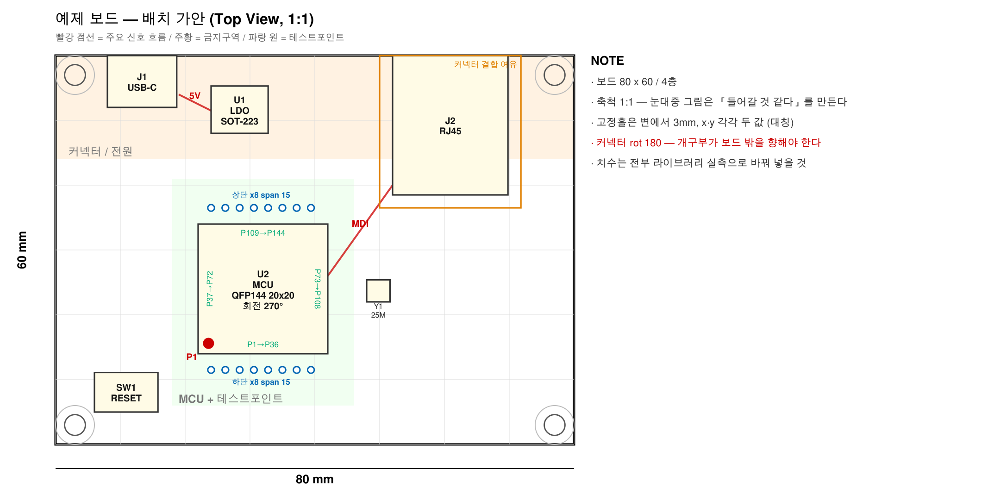

# altium-claude-skills

[English](README.md) | 한국어

Altium 하드웨어 설계를 Claude Code 로 하기 위한 스킬 모음.
심볼·풋프린트 제작, 회로도 검토, PCB 배치 세 단계를 다룬다.

실제 보드 한 장(부품 175개)을 회로도 검토부터 배치까지 끌고 가며 썼다.

| 스킬 | 하는 일 |
|---|---|
| `altium-library` | 심볼(.SchLib)·풋프린트(.PcbLib) 를 코드로 만들고 검증. 데이터시트·2D 도면 실측 포함 |
| `altium-schematic-review` | 회로도(.SchDoc) 검토 — 미결선·풋프린트 누락·넷 오류를 찾고 데이터시트로 판정 |
| `altium-pcb-placement` | PCB 배치 — 보드 사이즈 역산, 주요 IC·커넥터 회전 결정, 배치 가안 도면, 좌표 투입, 겹침 검사. 라우팅은 하지 않는다 |


## 설치

**Windows + PowerShell 전용이다.** 정션(`New-Item -ItemType Junction`)과
Altium 이 Windows 것이기 때문이다.

Claude Code 에게 이 repo 주소를 주고 "설치해줘" 라고 해도 된다.
아래 1~3 을 그대로 시키면 된다.

### 1. clone

**옮기지 않을 자리**에 받는다. 3번의 정션이 절대경로를 굽기 때문에,
나중에 폴더를 옮기면 정션을 다시 걸어야 한다.

```powershell
git clone https://github.com/ScottJeong/altium-claude-skills.git C:\tools\altium-claude-skills
```

### 2. Python 3.12 venv

스크립트가 이걸로 돈다. **정션보다 먼저 만든다** — 스킬이 걸려도 이게 없으면
스크립트가 전부 실패한다. 왜 3.12 인지와 MCP 설정은 아래 [필요한 것](#필요한-것) 에 있다.

```powershell
py -3.12 -m venv C:\tools\edatools
C:\tools\edatools\Scripts\python.exe -m pip install altium-monkey pymupdf
C:\tools\edatools\Scripts\python.exe -c "import altium_monkey, pymupdf; print('ok')"
```

### 3. 스킬 3개를 정션으로 걸기

`~/.claude/skills/` 아래에 건다. 정션은 심볼릭 링크와 달리 관리자 권한이 필요 없고,
동기화 클라이언트에는 평범한 폴더로 보인다.

```powershell
$repo = "C:\tools\altium-claude-skills"      # 1단계에서 clone 한 경로
foreach ($s in 'altium-library','altium-pcb-placement','altium-schematic-review') {
    New-Item -ItemType Junction -Path "$env:USERPROFILE\.claude\skills\$s" -Target "$repo\$s"
}
```

### 확인

`LinkType` 이 `Junction` 이어야 한다.

```powershell
Get-ChildItem "$env:USERPROFILE\.claude\skills" |
    Select-Object Name, LinkType, Target
```

그다음 Claude Code 를 **새로 열고** "이 회로도 검토해줘" 처럼 말해본다.
스킬이 걸리면 Claude 가 그 이름을 말하며 시작한다.
**세션 도중에 건 스킬은 그 세션에 안 뜬다.**

**정션은 절대경로를 굽는다.** repo 를 옮기면 정션을 다시 만들어야 한다.
정션이 싫으면 세 폴더를 그냥 복사해도 되지만, `git pull` 이 반영되지 않는다.

## 스킬 사이 의존

`altium-pcb-placement/scripts/connectivity_matrix.py` 는 `altium-schematic-review` 의
`net_erc.py` 를 형제 폴더 상대경로로 가져다 쓴다. **둘을 같이 설치해야 한다.**

---

## 필요한 것

### 검증된 조합

여기서 실제로 돌려본 조합이다. 다른 버전이 안 된다는 뜻은 아니고, 안 되면 알려달라.

| | 버전 |
|---|---|
| OS | Windows 11 |
| Python | 3.12.13 |
| `altium-monkey` | 2026.8.11 |
| `pymupdf` | 1.28.2 (MuPDF 1.28.2) |

### Altium Designer

Windows. **파일만 읽고 쓰는 단계는 Altium 을 안 켜도 된다.**
좌표 투입·스크린샷·라이브 라이브러리 조회는 켜야 한다.

### Python 3.12 + `altium_monkey`

스크립트가 Altium 파일(`.SchDoc` `.PcbDoc` `.PcbLib` `.SchLib`)을
[`altium_monkey`](https://github.com/wavenumber-eng/altium_monkey) 로 **직접 파싱**한다.
이 패키지가 Python `<3.13` 을 요구하므로 3.12 로 venv 를 따로 판다.
명령은 [설치 2단계](#2-python-312-venv) 에 있다.

스크립트는 **그 venv 의 `python.exe` 를 전체 경로로** 부른다. 스킬 본문은 이걸
`python` 이라고만 쓰니, PATH 의 `python` 이 그것이라고 가정하지 마라.

`pymupdf` 는 데이터시트·2D 도면 실측용이다.

### MCP: `altium-mcp`

떠 있는 Altium 을 조작한다. **좌표 투입**(`place_components`)·스크린샷·라이브
라이브러리 조회에 필요하다. 없으면 파일만 만지는 것은 전부 그대로 된다.

```powershell
git clone https://github.com/coffeenmusic/altium-mcp.git C:\tools\altium-mcp

claude mcp add altium-mcp --scope user -- `
    C:\tools\edatools\Scripts\python.exe C:\tools\altium-mcp\start_server.py
```

서버가 첫 호출 때 자기 venv 를 부트스트랩하고 Altium 에 스크립트 프로젝트를 설치한다.
`claude mcp list` 로 등록을 보고, Claude 에게 `get_server_status` 를 시켜 확인한다.

> 그쪽 README 는 Claude **Desktop** 방식(`.dxt` 확장)만 적혀 있다.
> Claude **Code** 는 위처럼 `claude mcp add` 로 붙인다.

### MCP: `pcbparts` (선택)

부품 사양·재고(`jlc_search`), 일반 설계 규칙(`get_design_rules`). 호스팅이라 설치 없다.

```powershell
claude mcp add --transport http pcbparts --scope user https://pcbparts.dev/mcp
```

없으면 데이터시트나 웹(`WebSearch`/`WebFetch`, Claude Code 기본 도구)에서 같은 걸 찾으면 된다.

### `eda-agent` 를 `altium-mcp` 와 같이 띄우지 마라

**Altium 의 스크립팅 슬롯은 전역으로 하나다.** `eda-agent` 는 Altium 안에 자체 폴링
루프를 띄워야 해서, 그걸 시작하면 `altium-mcp` 브릿지가 죽는다.

`altium-library` 의 3D 모델 절에 `eda-agent` 도구를 쓰는 **선택 단계**가 둘 있다
(`lib_extract_cse_zip`, `lib_easyeda_import`). 그 단계만 쓰려면 `altium-mcp` 를 내리고
`eda-agent` 를 띄운 뒤 되돌린다. 둘 다 수동 대체가 있다.

---

## 쓰는 법

스킬은 알아서 발동한다. 이름을 부를 필요 없이 **하려는 일을 그냥 말하면** 된다.
Claude 가 `description` 을 보고 맞는 스킬을 고른다.

```
# altium-library
"이 커넥터 데이터시트로 풋프린트랑 심볼 만들어줘"     (데이터시트 PDF 첨부)
"이거 라이브러리에 이미 있는지 봐줘"
"만든 풋프린트 도면이랑 맞는지 검증해줘"

# altium-schematic-review
"회로도 검토해줘"
"미결선 있나 봐줘"
"풋프린트 빠진 부품 있어?"

# altium-pcb-placement
"회로도 다 됐으니 PCB 배치하자"
"보드 크기 얼마나 나와야 해?"
"이 소켓 어느 방향으로 놓아야 하지?"
```

스킬이 바꾸는 건 **입력이 아니라 Claude 가 일하는 방식**이다. 그리기 전에 실측하고,
핀을 결함이라 부르기 전에 데이터시트를 보고, PcbDoc 을 건드리기 전에 1:1 가안 도면을
먼저 보여준다.

### 한 판이 어떻게 흘러가나

| 단계 | 주는 것 | 받는 것 |
|---|---|---|
| 라이브러리 | 데이터시트·2D 도면, 라이브러리 위치 | `.SchLib`/`.PcbLib` 와 **그걸 만든 생성 스크립트** |
| 회로도 검토 | 저장된 `.SchDoc` | **조치 필요 / 무해 / 미확인** 3분류, 각각 데이터시트 근거 |
| PCB 배치 | 제약(큰 커넥터를 어느 변에, 기구 한계) | 1:1 가안 도면 → 승인하면 실제 좌표 투입 |

가안 도면은 이렇게 나온다. 아래 그림은 `altium-pcb-placement/examples/plan.example.json`
을 `plan_svg.py` 로 렌더한 것이고, 그대로 돌려볼 수 있다.



배치가 실제로 진행되는 순서는 이렇다.

```
1. 회로도에서 연결 매트릭스를 뽑는다        누가 누구와 몇 넷인가
2. 라이브러리에서 부품 치수를 실측한다      공칭치로 그리지 않는다
3. 축을 누적해 보드 사이즈를 역산한다       "대충 100x100" 이 아니라 계산
4. 주요 IC 회전을 핀->변 매핑으로 정한다    4안을 점수와 함께 제시
5. 1:1 가안 도면(SVG/PNG)을 보여준다        <- 여기서 2~4회 왕복이 정상
6. 승인하면 PcbDoc 에 좌표를 투입한다
7. 겹침·보드 밖 검사를 돌린다
```

커넥터·소켓·주요 IC 는 왜 그 자리인지 근거를 대고 놓는다.
저항·커패시터는 관련 IC 옆에 겹치지 않게 모아만 두니 최종 위치는 사람이 잡는다.
그 자리는 라우팅 의도가 정하는 것이라 규칙으로 만들면 오히려 손해다.

### 당신에게 요구하는 것 둘

- **파일 파싱 단계 전에 Altium 에서 저장할 것.** 스크립트는 디스크의 파일을 읽는다.
  Altium 이 미저장 상태면 옛 버전을 놓고 답하게 된다
- **배치는 당신이 확정하기 전에는 투입하지 않는다.** 가안 도면은 다시 그리기 싸고
  PcbDoc 은 비싸다. 도면에서 **2~4회 왕복**은 정상이다

---

## 실제로 뭐가 들어 있나

스킬마다 `SKILL.md`(절차) + `references/`(함정 상세) + `scripts/`(실행 도구) 다.

### 스크립트 16개

**전부 Altium 없이 돈다.** 파일을 `altium_monkey` 로 직접 파싱하기 때문이다.
Claude 가 알아서 부르지만 직접 돌려도 되고, 전부 `--help` 가 있다.

#### `altium-library/scripts/`

| 스크립트 | 하는 일 |
|---|---|
| `survey_library.py` | **새로 만들기 전에 반드시 돌린다.** 라이브러리에 이미 뭐가 있는지 훑는다. 심볼만 있고 풋프린트가 없는 경우가 흔한데, 모르고 만들면 중복이 생기고 나중에 어느 게 진짜인지 아무도 모른다. 제조사 약칭·핀수로도 찾는다 |
| `measure_drawing.py` | 벤더 2D 도면 PDF 에서 홀 좌표·외곽을 **벡터로** 실측. 도면 문자는 벡터 아웃라인이라 텍스트 추출이 안 되고 렌더 픽셀 눈대중은 틀린다. **이미 아는 피치로 pt/mm 스케일을 역산**한다 |
| `fit_symbol_body.py` | 심볼 본체 최소 크기를 겹침 전수검사로 계산. 상/하 핀 이름은 90도 돌아 들어와서, 본체가 작으면 이름끼리 겹치는데 **좌표 검산으로도 SVG 렌더로도 안 잡힌다** |
| `audit_free_copper.py` | 풋프린트 구리층의 **자유 프리미티브**를 찾는다. region·arc·track 은 넷이 없어서 배선이 못 들어오는데, 증상이 「패드에서 나가는 건 되고 들어오는 건 안 된다」로 나타나 방향 문제로 오인하기 쉽다. 패드가 그 구리에 덮였는지까지 보고 배선 불가/주의로 가른다 |
| `diff_symbol.py` | 기준 심볼과 내가 만든 것을 **3층**으로 비교 — 파싱된 속성 / 레코드 순서(z-order) / 원시 바이트. 속성만 비교하면 "일치" 인데 화면은 딴판인 경우가 실제로 있었다 |

#### `altium-schematic-review/scripts/`

| 스크립트 | 하는 일 |
|---|---|
| `check_context.py` | **§0 전제 확인.** 검토 시작 전에 헛수고를 막는다. 가장 흔한 사고가 Altium 이 미저장인데 디스크 파일을 읽고 "전원부가 없다" 같은 결론을 내는 것이다 |
| `net_erc.py` | 회로도 넷 구성 + ERC 유사 검사 4종. 배선 위 핀만 세면 넷을 절반 넘게 놓친다 — **핀-핀 직결·핀-전원포트 직결·hidden 핀**을 다 처리한다 |
| `audit_footprints.py` | 회로도 부품의 풋프린트 링크를 뽑아 실물 라이브러리와 대조. PCB 로 넘어가기 전에 "풋프린트 없는 부품" 을 잡는다 |

#### `altium-pcb-placement/scripts/`

| 스크립트 | 하는 일 |
|---|---|
| `measure_from_lib.py` | **PcbDoc 없이** 회로도 + 라이브러리 폴더만으로 풋프린트 실측. Update PCB 를 안 돌려도 된다 |
| `connectivity_matrix.py` | 부품쌍 연결 매트릭스 + 기준부품 핀별 상대. 배치 근거는 "누가 누구와 몇 넷으로 붙어 있나" 다. 팬아웃 큰 전원 레일은 근거가 못 되므로 뺀다 |
| `pin_side_map.py` | 핀번호 → 변 매핑으로 **IC 회전 4안을 계산**. QFN/QFP 는 핀번호가 변을 결정하므로 취향이 아니라 계산으로 나온다 |
| `connector_facing.py` | 커넥터 개구부 방향 판정. 케이블 들어가는 쪽엔 패드가 없고 하우징만 있다 — **패드 bbox 와 실크 bbox 를 따로 재서 실크가 더 튀어나온 쪽**이 개구부다. 데이터시트를 안 봐도 된다 |
| `plan_svg.py` | 배치 가안 JSON → **축척 1:1** SVG/PNG. 눈대중 그림은 "들어갈 것 같다" 를 만들고 그건 늘 틀린다 |
| `plan_to_placements.py` | 가안 JSON → `place_components` 입력(mils). 가안은 mm·좌하단·**bbox**, Altium 은 mils·**컴포넌트 원점** — 이 둘은 같지 않다 |
| `overlap_check.py` | 배치 후 충돌 검사. **면을 갈라 본다** — 반대면끼리 XY 가 겹치는 건 정상이다(디커플링을 그렇게 놓는다). 단 관통홀은 판을 뚫으므로 예외로 잡고, **홀 하나씩** 비교한다(합치면 기구홀 4개짜리 소켓이 몸체 전체를 오탐한다). 패드 이탈과 실크 돌출을 나눠 보고 |
| `apply_outline.py` | 보드 외곽(모서리 라운드) + 대칭 고정홀 삽입. 제자리 수정이면 `.bak` 을 먼저 만든다 |

실행 예 — 커넥터 개구부 판정. 아래 `python` 은 [설치 2단계](#2-python-312-venv) 에서
만든 venv 의 `python.exe` 를 전체 경로로 부른 것이다.

```
> python connector_facing.py board.SchDoc --libs C:\libs

des  개구부 돌출 mm     상변  하변  좌변  우변   풋프린트
J1   -Y       9.06      180    0   270    90   RJ45_J1B1211CCD
J2   -Y       2.21      180    0   270    90   USB-C_16P

숫자 = 그 변에 놓을 때 줘야 할 rotation (반시계 도).
개구부가 보드 바깥을 향해야 한다. bbox 는 180° 회전으로 안 변하므로
겹침·외곽 검사에 안 걸린다 — 이 표로 따로 확인해야 한다.
```

「J1 을 상변에 놓으려면 180도」 라는 뜻이다. 데이터시트를 뒤질 필요가 없다.

### 참고 문서 (`references/`)

어렵게 얻은 것은 대부분 여기 있다 — **"이렇게 깨지고, 이렇게 알아본다"** 가 약 1,400줄.

| 파일 | 무엇을 막아주나 |
|---|---|
| `altium-library/references/altium-monkey-api.md` | 단위 규약(입력 mil, 되읽기 10mil), z-order 때문에 핀 이름이 안 보이는 것, 파라미터가 엉뚱한 좌표로 들어가는 것 |
| `altium-library/references/tool-traps.md` | `altium-mcp` / `eda-agent` 가 이상하게 구는 지점과, 틀린 결과가 어떻게 생겼는지 |
| `altium-library/references/drawing-measurement.md` | 벤더 도면은 문자가 벡터 아웃라인이다. 렌더 픽셀 눈대중은 세 번 하면 세 번 틀린다 |
| `altium-schematic-review/references/pin-verdict.md` | 플로팅 핀이 진짜 결함인지 판정하는 법 |
| `altium-schematic-review/references/altium-script-traps.md` | `run_altium_script` 가 디버거에 멈춰 모든 MCP 도구를 막는 것 |
| `altium-schematic-review/references/net-build-notes.md` | 기하 넷리스트가 Altium 컴파일러와 어긋나는 이유 |
| `altium-pcb-placement/references/rotation-decision.md` | 핀→변 매핑으로 IC 회전 유도, 커넥터 개구부 방향 |
| `altium-pcb-placement/references/board-sizing.md` | 보드 사이즈 역산, 고정홀 대칭, 모서리 라운드 |
| `altium-pcb-placement/references/injection.md` | 컴포넌트 원점 ≠ bbox 중심, 오서링 빌더가 직접 수정을 삼키는 것 |
| `altium-pcb-placement/references/plan-schema.md` | `plan.json` 형식. 동작 예제는 `examples/` 에 |

---

## 무엇이 Altium 없이 되나

| | Altium 필요 | 파일만 |
|---|---|---|
| 라이브러리 제작·검증 | 육안 확인 | 생성·비교·측정 |
| 회로도 검토 | 컴파일 넷 대조(선택) | 넷 구성·ERC 유사 검사·풋프린트 대조 |
| PCB 배치 | **좌표 투입**·스크린샷 | 치수 실측·회전 계산·가안 도면·겹침 검사 |

**외주 PCB 설계업체에 넘길 배치 가안은 Altium 없이도 만들 수 있다.**
회로도와 라이브러리(또는 데이터시트)만 있으면 된다.

---

## 잘 안 될 때

| 증상 | 원인과 조치 |
|---|---|
| `altium_monkey 없음. edatools venv 파이썬으로 실행하라.` | PATH 의 `python` 으로 돌렸다. venv 의 `python.exe` 를 **전체 경로로** 부른다 |
| `pip install altium-monkey` 가 실패한다 | Python 3.13 이상이다. 이 패키지는 `<3.13` 을 요구한다. `py -3.12 -m venv` 로 다시 판다 |
| 스킬이 안 걸린다 | ① 정션이 `~/.claude/skills/` 아래 있는지 ② Claude Code 를 **새로 열었는지**. 세션 도중에 건 스킬은 그 세션에 안 뜬다 |
| 검토 결과가 화면과 다르다 | Altium 에서 저장을 안 했다. 스크립트는 디스크 파일을 읽는다. `Ctrl+S` 후 다시 |
| 외곽·홀을 넣었는데 사라진다 | Altium 이 그 PcbDoc 을 열고 있었다. Altium 이 저장하는 순간 덮인다. 닫거나, 사용자가 저장한 뒤 돌리고 끝나면 reload |
| MCP 도구가 전부 응답이 없다 | `run_altium_script` 가 런타임 에러로 **Altium 디버거에 멈춰 있다.** Altium 창에서 `Ctrl+F3` 를 눌러야 풀린다. 스크립팅 슬롯이 전역으로 하나라 이때 다른 MCP 도구도 같이 막힌다 |
| 커넥터가 뒤집혀 있는데 검사가 통과한다 | **bbox 는 180도 회전에 안 변한다.** 겹침·외곽 검사로는 못 잡는다. `connector_facing.py` 로 개구부 방향을 따로 본다 |
| 부품이 가안보다 몇 mm 밀려 있다 | **컴포넌트 원점 ≠ bbox 중심.** 풋프린트 원점은 pad1 일 수도 몸체 중심일 수도 있다. `plan_to_placements.py` 가 보정하니 좌표를 손으로 넣지 마라 |

---

## 기여

이슈·PR 환영. 두 가지만 지키면 계속 쓸 만하다.

- **규칙으로 쓰고 실측 숫자로 뒷받침한다.** 사고 경위를 서술하지 않는다.
  `QFN32 몸체 4.00 → 실제 풋프린트 7.05×7.00` 이 정보다
- **특정 칩·보드 이름과 한 설계의 값을 넣지 않는다.** 범용 스킬이고,
  판정은 그때그때 데이터시트로 한다

## 라이선스

[MIT](LICENSE)
